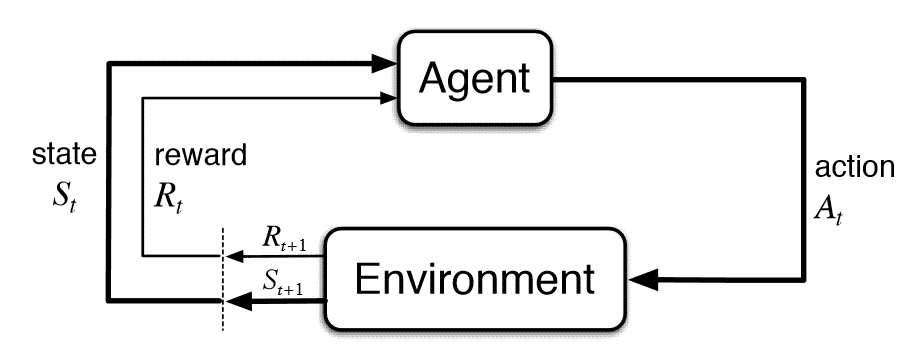

# Q-Learning

Apprentissage par renforcement (reinforcement learning) avec Q-Learning.

## Principe 
- *L'agent* apprend à prendre des décisions en fonction de l'état dans lequel il se trouve.
- *Reward* : récompense ou punition (Rt)
- *State* : état dans lequel se trouve l'agent, lorsqu'il prend une décision, l'agent change d'état (St)
- *Environment* : environnement dans lequel l'agent évolue
- *Action* : action que l'agent peut effectuer (At)

### Fonctionnement 
 
- L'environnement ou se trouve l'agent il faut le subdiviser en un ensemble d'état, et donc il pourra parcourir ces états.
- Tbleau de Q-Value : tableau qui contient les valeurs de Q-Value pour chaque état et chaque action possible. 
- Exploration vs exploitation : Pendnat l'apprentissage, l'agent va explorer l'environnement et apprendre de nouvelles choses, mais il faut aussi qu'il exploite ce qu'il a appris pour prendre les bonnes décisions.
- Mise à jour des valeurs de la table : Equation de Bellman
Formule : 

$$Q(s_t, a_t) = Q(s_t, a_t) + \alpha * (R_t + \gamma * max(Q(s_{t+1}, a)) - Q(s_t, a_t))$$

Avec :
- $\alpha$ : learning rate
- $\gamma$ : discount factor (entre 0 et 1) qui permet de déterminer l'importance de l'action à venir.
- $\epsilon$ : exploration rate (entre 0 et 1) qui permet de déterminer la probabilité que l'agent explore ou exploite l'environnement.

### Deep Q-Learning

- Deep Q-Learning : Q-Learning avec un réseau de neurones

## TO DO 
- [ ] Implémenter Q-Learning MAS
- [ ] Visualiser les résultats

