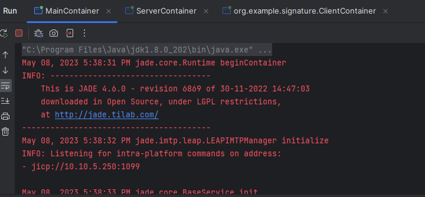
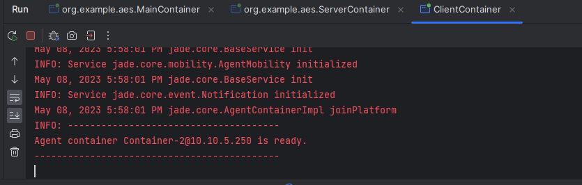
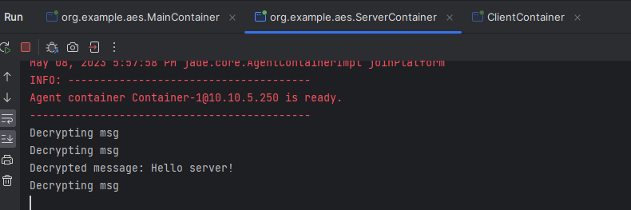
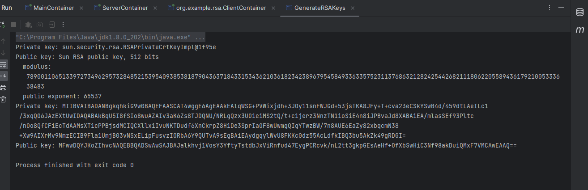
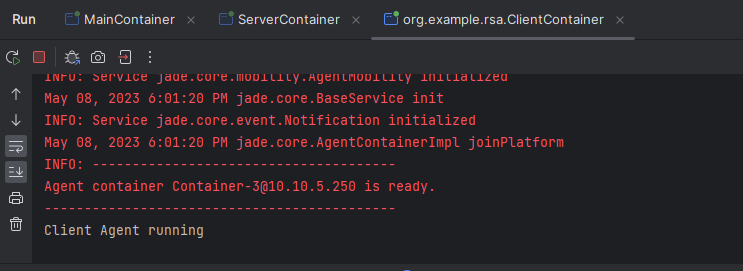
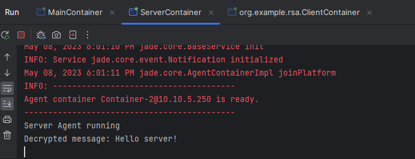
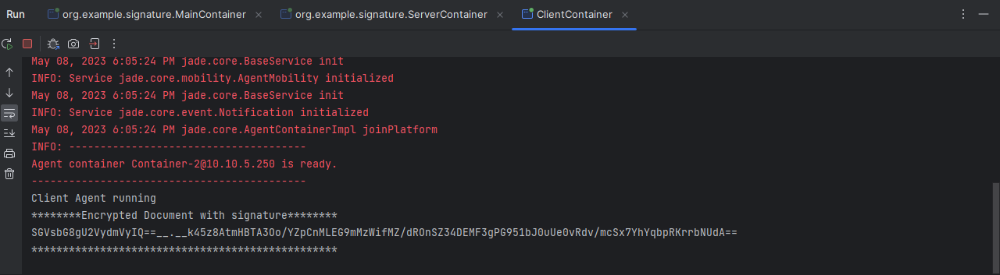
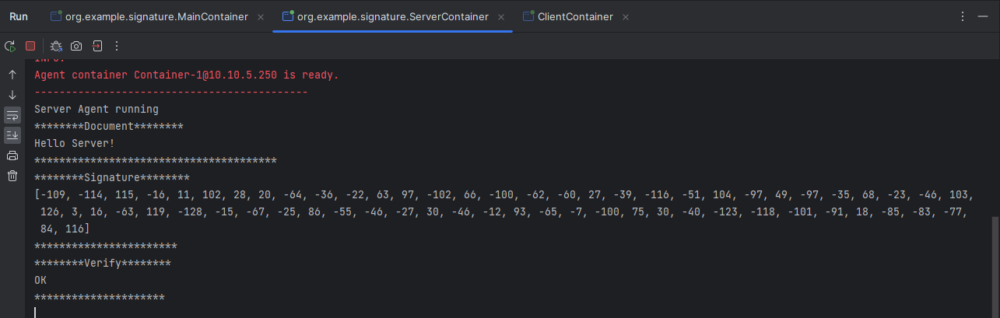
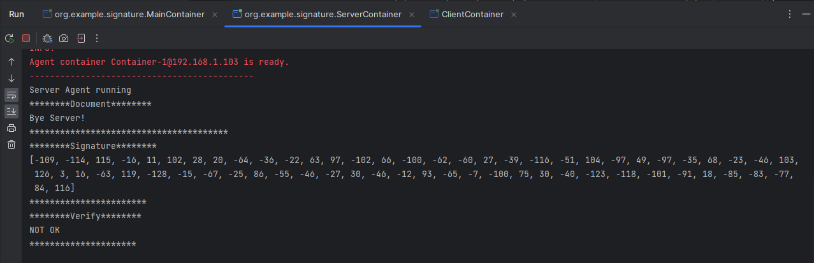

# Cryptage et sécurité de données

> Réalisé par :
> 
> **AITOULAHYANE Aya**

## AES

### Principe

L'AES (Advanced Encryption Standard) est un algorithme de chiffrement symétrique par blocs. Il est utilisé par exemple dans le protocole TLS (Transport Layer Security) pour sécuriser les échanges sur internet.

### Application

Dans le package `aes`, vous trouverez une implémentation de l'AES comme ceci :

- MainContainer
```java
public class MainContainer {
    public static void main(String[] args) throws ControllerException {
        Runtime runtime=Runtime.instance();
        ProfileImpl profile=new ProfileImpl();
        profile.setParameter("gui","true");
        AgentContainer agentContainer=runtime.createMainContainer(profile);
        agentContainer.start();
    }

}
```


- ServerAgent
```java
public class ServerAgent extends Agent {

    @Override
    protected void setup() {
        String password = (String) getArguments()[0];
        addBehaviour(new CyclicBehaviour() {
            @Override
            public void action() {
                ACLMessage aclMessage = receive();
                System.out.println("Decrypting msg");
                if (aclMessage != null) {
                    String encry = aclMessage.getContent();
                    byte[] encryptMSG = Base64.getDecoder().decode(encry);
                    SecretKey secretKey = new SecretKeySpec(password.getBytes(), "AES");
                    try {
                        Cipher cipher = Cipher.getInstance("AES");
                        cipher.init(Cipher.DECRYPT_MODE, secretKey);
                        byte[] decrypted = cipher.doFinal(encryptMSG);
                        System.out.println("Decrypted message: " + new String(decrypted));
                    } catch (Exception e) {
                        throw new RuntimeException(e);
                    }

                } else {
                    block();
                }
            }
        });
    }
}
```

- ServerContainer
```java
public class ServerContainer {
    public static void main(String[] args) throws ControllerException {
        Runtime runtime = Runtime.instance();
        ProfileImpl profile = new ProfileImpl();
        profile.setParameter(Profile.MAIN_HOST, "localhost");
        AgentContainer agentContainer= runtime.createAgentContainer(profile);
        String password = "1234567812345678";//128 bit key
        AgentController serverAgent= agentContainer.createNewAgent("server", ServerAgent.class.getName(), new Object[]{password});
        serverAgent.start();
    }

}
```

- ClientAgent
```java
public class ClientAgent extends Agent {
    @Override
    protected void setup() {
        addBehaviour(new OneShotBehaviour() {
            @Override
            public void action() {
                System.out.println("Client Agent running");

                String message ="Hello server!";
                String encodedPbk = (String) getArguments()[0];
                byte[] decodedPbk = Base64.getDecoder().decode(encodedPbk);

                try {
                    KeyFactory keyFactory = KeyFactory.getInstance("RSA");
                    PublicKey publicKey = keyFactory.generatePublic(new X509EncodedKeySpec(decodedPbk));
                    Cipher cipher = Cipher.getInstance("RSA");
                    cipher.init(Cipher.ENCRYPT_MODE, publicKey);
                    byte[] encrypted = cipher.doFinal(message.getBytes());
                    String encryptedEncoded = Base64.getEncoder().encodeToString(encrypted);
                    ACLMessage aclMessage = new ACLMessage(ACLMessage.INFORM);
                    aclMessage.setContent(encryptedEncoded);
                    aclMessage.addReceiver(new AID("server", AID.ISLOCALNAME));
                    send(aclMessage);

                } catch (Exception e) {
                    throw new RuntimeException(e);

                }
            }
        });
    }
}
```

- ClientContainer
```java
public class ClientContainer {
    public static void main(String[] args) throws StaleProxyException {
        Runtime runtime = Runtime.instance();
        ProfileImpl profile = new ProfileImpl();
        profile.setParameter(Profile.MAIN_HOST, "localhost");
        AgentContainer agentContainer = runtime.createAgentContainer(profile);
        String password = "1234567812345678";//128 bit key
        AgentController clientAgent = agentContainer.createNewAgent("client", ClientAgent.class.getName(), new Object[]{password});
        clientAgent.start();
    }
}
```
### Résultat

- ClientContainer




- ServerContainer




## RSA

### Principe

Le RSA (Rivest, Shamir et Adleman) est un algorithme de chiffrement asymétrique. Il est utilisé par exemple dans le protocole TLS (Transport Layer Security) pour sécuriser les échanges sur internet.

### Application

Dans le package `rsa`, vous trouverez une implémentation du RSA comme ceci :


Nous allons créer une classe `GenerateRSAKeys` pour générer les clés RSA

```java
public class GenerateRSAKeys {
    public static void main(String[] args) throws NoSuchAlgorithmException {
        KeyPairGenerator keyPairGenerator = KeyPairGenerator.getInstance("RSA");
        keyPairGenerator.initialize(512);
        KeyPair keyPair = keyPairGenerator.generateKeyPair();
        PrivateKey privateKey = keyPair.getPrivate();
        PublicKey publicKey = keyPair.getPublic();
        System.out.println("Private key: " + privateKey);
        System.out.println("Public key: " + publicKey);
        String encoderPRK = Base64.getEncoder().encodeToString(privateKey.getEncoded());
        String encoderPUBK = Base64.getEncoder().encodeToString(publicKey.getEncoded());
        System.out.println("Private key: " + encoderPRK);
        System.out.println("Public key: " + encoderPUBK);

    }
}
```
- Exécution



On garde le même code que l'AES sauf le `ServerAgent` et le `ClientAgent`

- ServerAgent
```java
public class ServerAgent extends Agent {

    @Override
    protected void setup() {
        System.out.println("Server Agent running");

        String encodedPrk = (String) getArguments()[0];
        byte[] decodePrk = Base64.getDecoder().decode(encodedPrk);
        addBehaviour(new CyclicBehaviour() {
            @Override
            public void action() {
                ACLMessage aclMessage = receive();
                if (aclMessage != null) {
                    String encryEncodedMsg = aclMessage.getContent();
                    byte[] encryptMSG = Base64.getDecoder().decode(encryEncodedMsg);
                    try {
                        KeyFactory keyFactory = KeyFactory.getInstance("RSA");
                        PrivateKey privateKey = keyFactory.generatePrivate(new PKCS8EncodedKeySpec(decodePrk));
                        Cipher cipher = Cipher.getInstance("RSA");
                        cipher.init(Cipher.DECRYPT_MODE, privateKey);
                        byte[] decrypted = cipher.doFinal(encryptMSG);
                        System.out.println("Decrypted message: " + new String(decrypted));
                    } catch (Exception e) {
                        throw new RuntimeException(e);
                    }

                } else {
                    block();
                }
            }
        });
            }
}
```

- ClientAgent
```java
public class ClientAgent extends Agent {
    @Override
    protected void setup() {
        addBehaviour(new OneShotBehaviour() {
            @Override
            public void action() {
                System.out.println("Client Agent running");

                String message ="Hello server!";
                String encodedPbk = (String) getArguments()[0];
                byte[] decodedPbk = Base64.getDecoder().decode(encodedPbk);

                try {
                    KeyFactory keyFactory = KeyFactory.getInstance("RSA");
                    PublicKey publicKey = keyFactory.generatePublic(new X509EncodedKeySpec(decodedPbk));
                    Cipher cipher = Cipher.getInstance("RSA");
                    cipher.init(Cipher.ENCRYPT_MODE, publicKey);
                    byte[] encrypted = cipher.doFinal(message.getBytes());
                    String encryptedEncoded = Base64.getEncoder().encodeToString(encrypted);
                    ACLMessage aclMessage = new ACLMessage(ACLMessage.INFORM);
                    aclMessage.setContent(encryptedEncoded);
                    aclMessage.addReceiver(new AID("server", AID.ISLOCALNAME));
                    send(aclMessage);

                } catch (Exception e) {
                    throw new RuntimeException(e);

                }
            }
        });
    }
}
```


### Résultat

- ClientContainer



- ServerContainer



## SHA256withRSA

### Principe

SHA256withRSA est un algorithme de signature numérique. Il est utilisé par exemple dans le protocole TLS (Transport Layer Security) pour sécuriser les échanges sur internet.


### Application

Dans le package `signature`, vous trouverez une implémentation du SHA256withRSA comme ceci :

On garde le même code que l'AES sauf le `ServerAgent` et le `ClientAgent`

- ServerAgent
```java
public class ServerAgent extends Agent {

    @Override
    protected void setup() {
        System.out.println("Server Agent running");

        String encodedPbk = (String) getArguments()[0];
        byte[] decodePbk = Base64.getDecoder().decode(encodedPbk);
        addBehaviour(new CyclicBehaviour() {
            @Override
            public void action() {
                ACLMessage aclMessage = receive();
                if (aclMessage != null) {
                    String documentSign = aclMessage.getContent();
                    String[] documentSplit = documentSign.split("__.__");


                    byte[] decodedDocument = Base64.getDecoder().decode(documentSplit[0]);
                    
                    byte[] decodedSign = Base64.getDecoder().decode(documentSplit[1]);

                    try {
                        KeyFactory keyFactory = KeyFactory.getInstance("RSA");
                        PublicKey publicKey = keyFactory.generatePublic(new X509EncodedKeySpec(decodePbk));
                        Signature signature = Signature.getInstance("SHA256withRSA");
                        signature.initVerify(publicKey);
                        signature.update(decodedDocument);
                        boolean verify = signature.verify(decodedSign);
                        System.out.println("********Document********");
                        System.out.println(new String(decodedDocument));
                        System.out.println("***************************************");
                        System.out.println("********Signature********");
                        System.out.println(Arrays.toString(decodedSign));
                        System.out.println("***********************");
                        System.out.println("********Verify********");
                        System.out.println(verify?"OK":"NOT OK");
                        System.out.println("*********************");

                    } catch (Exception e) {
                        throw new RuntimeException(e);
                    }

                } else {
                    block();
                }
            }
        });
            }
}
```

- ClientAgent
```java
public class ClientAgent extends Agent {
    @Override
    protected void setup() {
        addBehaviour(new OneShotBehaviour() {
            @Override
            public void action() {
                System.out.println("Client Agent running");

                String documents = "Hello Server!";
                String encodedPrk = (String) getArguments()[0];
                byte[] decodedPrk = Base64.getDecoder().decode(encodedPrk);

                try {
                    KeyFactory keyFactory = KeyFactory.getInstance("RSA");
                    PrivateKey privateKey = keyFactory.generatePrivate(new PKCS8EncodedKeySpec(decodedPrk));
                    Signature signature = Signature.getInstance("SHA256withRSA");
                    signature.initSign(privateKey);
                    signature.update(documents.getBytes());
                    byte[] sign = signature.sign();
                    String encodedSign = Base64.getEncoder().encodeToString(sign);
                    String encodedDocuments = Base64.getEncoder().encodeToString(documents.getBytes());
                    String encryptedEncoded = encodedDocuments + "__.__" + encodedSign;


                    System.out.println("********Encrypted Document with signature********");
                    System.out.println(encryptedEncoded);
                    System.out.println("*************************************************");


                    ACLMessage aclMessage = new ACLMessage(ACLMessage.INFORM);
                    aclMessage.setContent(encryptedEncoded);
                    aclMessage.addReceiver(new AID("server", AID.ISLOCALNAME));
                    send(aclMessage);

                } catch (Exception e) {
                    throw new RuntimeException(e);

                }
            }
        });
    }
}
```

### Résultat

- ClientContainer



- ServerContainer




On essaie de modifier le document et on relance le programme

```java
byte[] decodedDocument = Base64.getDecoder().decode(documentSplit[0]);
decodedDocument = new String(decodedDocument).replace("Hello", "Bye").getBytes();
byte[] decodedSign = Base64.getDecoder().decode(documentSplit[1]);
```


---
